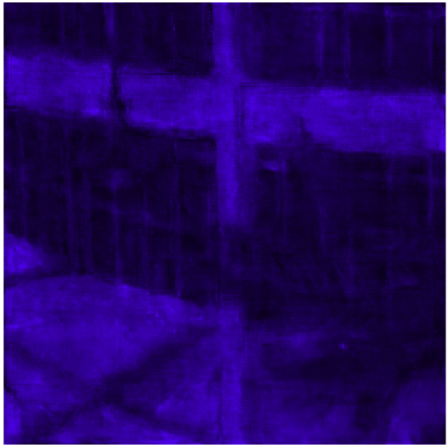
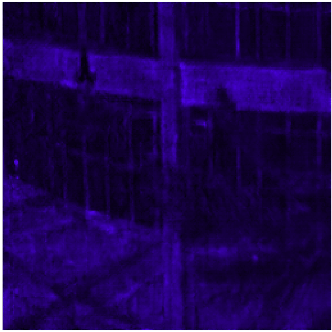

# SAH-SCI: Self-Supervised Adapter for Efficient Hyperspectral Snapshot Compressive Imaging (ECCV 2024)

Code for [](https://www.ecva.net/papers/eccv_2024/papers_ECCV/papers/08105.pdf)

[Haijin Zeng](https://navyzeng.github.io/)<sup>*<sup>,[Yuxi Liu](https://github.com/lyuxi)<sup>*<sup>, [Yongyong Chen](https://faculty.hitsz.edu.cn/chenyongyong?eqid=d6f576c70009d122000000066467508a), Youfa Liu, Chong Peng, Jingyong Su

IMEC-Ghent University  Belgium, Harbin Institute of Technology (Shenzhen)

<table>
    <tr>
        <th style="text-align: center;">HDNET</th>
        <th style="text-align: center;">HDNET+SAH</th>
        <th style="text-align: center;">MSTPP</th>
        <th style="text-align: center;">MSTPP+SAH</th>
    </tr>
    <tr>
        <td></td>
        <td></td>
        <td></td>
        <td></td>
    </tr>
</table>


**Abstract**

Hyperspectral image (HSI) reconstruction is vital for recovering spatial-spectral information from compressed measurements in
coded aperture snapshot spectral imaging (CASSI) systems. Despite theeffectiveness of end-to-end and deep unfolding methods, their reliance on substantial training data poses challenges, notably the scarcity of labeled HSIs. Existing approaches often train on limited datasets, such as KAIST and CAVE, leading to biased models with poor generalization capabilities. Addressing these challenges, we propose a universal Self-Supervised Adapter for Hyperspectral Snapshot Compressive Imaging (SAH-SCI). Unlike full fine-tuning or linear probing, SAH-SCI enhances model gen- eralization by training a lightweight adapter while preserving the original model’s parameters. We propose a novel approach that combines spectral and spatial adaptation to enhance an image model’s capacity for spatial- spectral reasoning. Additionally, we introduce a customized adapter self-supervised loss function that captures the consistency, group invariance and image uncertainty of CASSI imaging. This approach effectively reduces the solution space for ill-posed HSI reconstruction. Experimental results demonstrate SAH’s superiority over previous methods with fewer parameters, offering simplicity and adaptability to any end-to-end or unfolding methods. Our approach paves the way for leveraging more robust image foundation models in future hyperspectral imaging tasks.


## Architecture

## Framework of SAH-SCI

  

Mask $\mathbf{\Phi}$ and measurement $\mathbf{y}$ are input into the pre-trained model to obtain the initial results $\mathbf{X}_{pre}$, where the pre-trained model parameters are frozen. Then $\mathbf{X}_{pre}$ is fed into the self-supervised adapter SAH to obtain the HSI reconstruction result $\mathbf{X}_{rec}$. Bottom:Self-supervised loss component details.

##  Self-Supervised Adapter SAH


The architecture of SAH. (a) SAH stacks spatial-spectral convolutions with U-shaped structure. (b) The structure of the spatial-spectral convolution. (c) Frequency Adaption. Skip features and backbone features are concatenated by adaptive learnable weights based on frequency domain information.

## Usage

## Prepare pre-trained model and dataset

Download the pretrained model zoo from ([Google Drive](https://drive.google.com/drive/folders/1zgB7jHqTzY1bjCSzdX4lKQEGyK3bpWIx?usp=sharing) / [Baidu Disk](https://pan.baidu.com/s/1CH4uq_NZPpo5ra2tFzAdfQ?pwd=mst1), code: `mst1`) or your own pretrained model and place them to `./model_zoo/`. Prepare your dataset  and place them to `./datasets/your dataset`. We use [ICVL](https://cndaqiang.github.io/ICVL-Natural-Hyperspectral-Image-Database/index.html) ,[Harvard](https://vision.seas.harvard.edu/hyperspec/download.html) and [NTIRE 2022](https://aistudio.baidu.com/datasetdetail/187778) dataset to validate our approach. 

This code is based on HDNET trained on ICVL. I f you need to use your own dataset and pretrained model, please modify dataset loading method in `utils.py` and pre-trained model loading method in`train.py` . 

## Create Environment

- Python 3 (Recommend to use [Anaconda](https://www.anaconda.com/download/#linux))
- NVIDIA GPU + [CUDA](https://developer.nvidia.com/cuda-downloads)

- Python packages:

```
  pip install -r requirements.txt
```

## Experiment

### Training

```
python train.py \
--gpu_id  0 \
--dataset_path  ./datasets/ICVL/ \
--mask_path ./datasets/mask/  \
--model_path ./checkpoint 
```

### Testing

The trained SAH model is placed in`./checkpoint `.

```
python test.py \
--gpu_id 0 \
--dataset_path  ./datasets/ICVL/ \
--checkpoint_path  ./checkpoint/(trained SAH.pth) \
```

## Citation

If you find the code helpful in your research or work, please cite the following paper:

```
@InProceedings{liu2024sahsci,
    title     = {SAH-SCI: Self-Supervised Adapter for Efficient Hyperspectral Snapshot Compressive Imaging}, 
    author    = {Haijin Zeng and Yuxi Liu and Yongyong Chen and Youfa Liu and Chong Peng and Jingyong Su},
    booktitle = {ECCV},
    year      = {2024},
}
```

This implementation is based on / inspired by https://github.com/caiyuanhao1998/MST?tab=readme-ov-file. Thanks for their generous open source.

